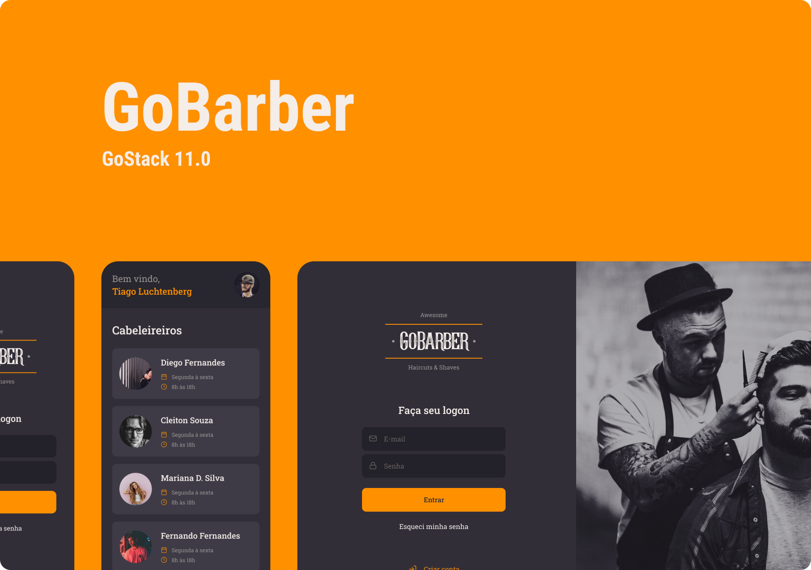

<h4 align="center">
🚧 Status 🚀 Em construção... 🚧
</h4>

# GoBarber

Aplicação para agendar e gerenciar serviços de cabeleleiros/barbeiros

# Tecnologias utilizadas

- [Node](https://nodejs.org/en/)
- [Express](https://expressjs.com/)
- [React](https://reactjs.org/)
- [React Native](https://reactnative.dev/)
- [Expo](https://docs.expo.io/)
- [JWT](https://jwt.io/)
- [TypeORM](https://typeorm.io/)
- [Styled-Components](https://styled-components.com/)
- [Jest](https://jestjs.io/en/)
- [TypeScript](https://www.typescriptlang.org/)
- [Yarn Workspaces](https://classic.yarnpkg.com/en/docs/workspaces/)
- [Unform](https://unform.dev/)

# Execute o Projeto

### Pré-requisitos

Antes de começar, você vai precisar ter instalado em sua máquina as seguintes ferramentas:

[Git](https://git-scm.com), [Node.js](https://nodejs.org/en/), [Yarn](https://classic.yarnpkg.com/lang/en/). Além disto é bom ter um editor para trabalhar com o código como [VSCode](https://code.visualstudio.com/)

## Clone o repositório

    $ git clone https://github.com/harlancleiton/go-barber
    $ cd go-barber

## Instale as dependências

    $ yarn install

## Estrutura de pastas

Este repositório utiliza a estrutura de monorepo, mantido através do [Yarn Workspaces](https://classic.yarnpkg.com/en/docs/workspaces/)

    # Projeto backend:
    $ cd server

    # Projetos que consumirão nossa API:
    $ cd clients
    # Sendo esses:
    $ cd mobile
    $ cd web

## Defina as variáveis de ambiente

- Dentro de cada projeto existe um arquivo chamado `.env.example` copie o conteúdo dele em um novo arquivo chamado `.env`; no `server` é necessário informar ao [TypeORM](https://typeorm.io/) nosso banco de dados, para isso crie um arquivo `ormconfig.json`, para isso use o arquivo `ormconfig.example.json` como guia.
- Para executar os testes deve ser criado um arquivo `.env.test` com o mesmo conteúdo (mas com as configurações do ambiente de execução de testes)

### Executando o projeto

    # Server
    cd server
    yarn dev

    # Mobile
    cd clients/mobile
    yarn dev

    # Web
    cd clients/web
    yarn dev

### Executando os testes

Existem duas formas de executarmos os testes: de forma individual, ou seja, dentro de cada projeto, ou do monorepo.

    # Monorepo, na raiz do repositório:
    $ yarn test

    # Cada projeto de forma isolada:
    # Entre na pasta do projeto especifico, exemplo server
    $ cd server
    $ yarn test

# Features

## Web

- [x] Criar conta
- [x] Fazer logon
- [ ] Recuperar senha
- [ ] Painel do prestador de serviços
- [ ] Detalhes do agendamento
- [ ] Atualização de perfil
- [ ] Central de notificações

## Mobile

- [x] Criar conta
- [x] Fazer logon
- [ ] Recuperar senha
- [ ] Agendamento de serviços
- [ ] Paginação de agendamentos
- [ ] Detalhes do agendamento
- [ ] Atualização de perfil

## Server

- [x] Registro de usuários
- [x] Autenticação do usuário
- [ ] Recuperar senha
- [ ] Disparo de eventos
- [ ] Queues
- [ ] Envio de emails
- [ ] Paginação de prestadores
- [ ] Criação de agendamentos
- [ ] Envio de notificações (real-time)
- [ ] Paginação de notificações
- [ ] Paginação de agendamentos (cliente)
- [ ] Paginação de agendamentos (prestador)
- [ ] Cache
